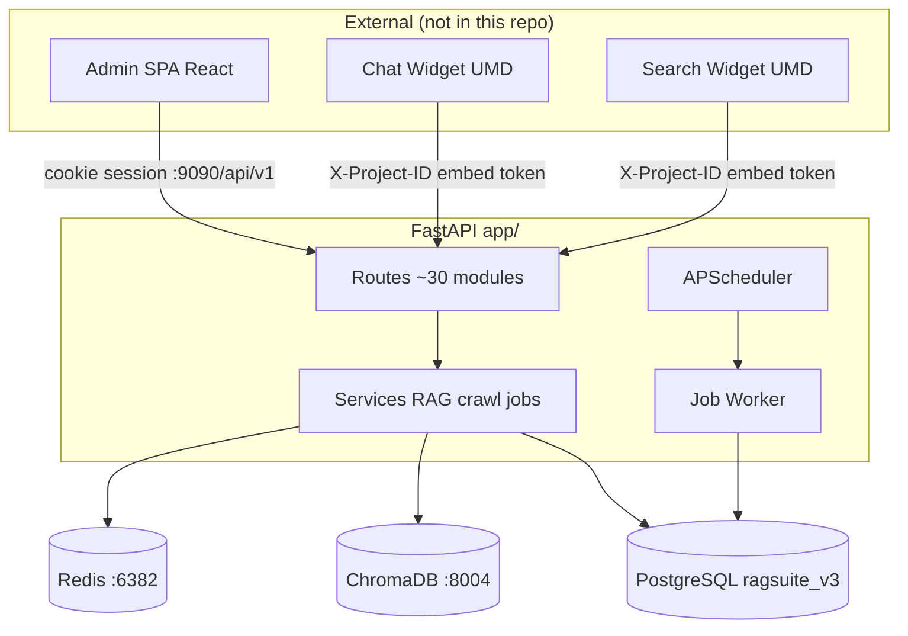

# AI Project Context Report — RAGSuite Standalone Backend

**Generated:** 2026-07-07  
**Agent:** Cursor AI (context sync from monorepo)  
**Repository:** `/Users/arun/Documents/RAGSuite_Server/backend`  
**Monorepo reference:** `/Users/arun/Desktop/RAGSUITE`  
**Next milestone:** Organization architecture

---

## Project Overview

### What This Repo Is

**Standalone backend** for RAGSuite — the same multi-tenant RAG platform as the full monorepo, extracted for independent deployment. Provides crawl, document ingest, connector sync, Chroma indexing, AI chat/search APIs, widgets API surface, analytics, and background job processing.

**No frontend in this repository.** External clients: [docs/backend/external-client-contract.md](../backend/external-client-contract.md).

### Key Facts

- [Fact] App code at **repo root** (`app/`, `alembic/`, `run.py`), not `backend/`.  
  Evidence: `README.md`, `AGENTS.md`, `app/main.py`

- [Fact] API base `/api/v1`; dev port **9090** (monorepo used 8000).  
  Evidence: `README.md`, `docker-compose.yml`, `run.py`

- [Fact] Auth endpoints: **`/api/v1/crawl/auth/*`**, not `/auth/*`.  
  Evidence: `app/routes/crawl.py`, `docs/backend/api-reference.md`

- [Fact] Required env: `DATABASE_URL`, `JWT_SECRET_KEY`, `CUSTOM_LLM_INTERNAL_API_KEY`.  
  Evidence: `app/settings.py`, `.env.example`, `app/main.py` lifespan

- [Fact] Background jobs: PostgreSQL `background_jobs` + `python -m app.worker`.  
  Evidence: `app/services/job_queue.py`, `app/worker.py`

- [Fact] Five connectors shipped: Drive, Notion, Confluence, SharePoint, Slack.  
  Evidence: `app/routes/connectors*.py`, `docs/connectors/README.md`, `scripts/smoke_connectors.py`

- [Fact] `start.sh` runs backend only (Redis, Chroma, worker, API).  
  Evidence: `start.sh` lines 11–15

- [Fact] Isolated ports: API 8002, Chroma 8003, Redis 6380, Postgres `ragsuite_v3`, target Expo web `FRONTEND_BASE_URL` 8081 (legacy Vite 5175).  
  Evidence: `README.md`, `docker-compose.yml`, `.env.example`

### Assumptions

- [Assumption] Monorepo at `/Users/arun/Desktop/RAGSUITE` remains the reference for full-stack behavior and frontend contract.  
  Rationale: User-directed context source; same product lineage.

- [Assumption] Production may use supervisord per `docs/operations/deployment.md`.  
  Rationale: Documented; `PROD_ROOT=/home/web/ragsuite_backend`.

---

## Architecture Summary

### System Diagram (this repo + external clients)



### Module Map

| Module | Path | Responsibility |
| ------ | ---- | -------------- |
| Routes | `app/routes/` | HTTP API surface |
| Auth | `app/auth.py` | JWT, sessions, widget auth, API keys |
| RAG | `app/services/rag/` | Embed, retrieve, LLM generate |
| Crawl | `app/services/crawler.py` | Scrapy + Playwright |
| Jobs | `app/services/job_queue.py` | Queue claim, handlers |
| Connectors | `app/services/connectors/` | Drive, Notion sync |
| Admin UI | *External* | Monorepo `frontend/client/` |
| Widgets | *External* | Monorepo UMD builds |

### Standalone vs Monorepo

| Aspect | Standalone backend | Monorepo RAGSUITE |
|--------|-------------------|-------------------|
| Code path | `app/` | `backend/app/` |
| API port | 8002 | 8000 |
| Chroma | 8003 | 8001 typical |
| Redis | 6380 | 6379 |
| Frontend | External / optional | `frontend/client/` |
| DB name | `ragsuite_v3` | `rag_suite` |

**Product intent:** unchanged — same APIs, auth model, job types, connector framework.

---

## Technology Stack

| Category | Technology | Notes |
| -------- | ---------- | ----- |
| Language | Python 3.14 | `scripts/setup.sh` |
| API | FastAPI | `app/main.py` |
| ORM | SQLAlchemy + Alembic | `app/models.py`, `alembic/` |
| Database | PostgreSQL 15+ | `ragsuite_v3` |
| Vector | ChromaDB 1.5+ HTTP | Port 8003 |
| Cache | Redis 7 | Port 6380 |
| Jobs | Postgres `background_jobs` | `job_queue.py` |
| Deploy | Docker Compose | `docker-compose.yml` |

---

## Major Features

| Feature | Status | Key files |
| ------- | ------ | --------- |
| Web crawl | Shipped | `crawler.py`, `crawl.py` |
| Document upload | Shipped | `documents.py`, `ingest_runtime.py` |
| RAG chat/search | Shipped | `rag.py`, `services/rag/` |
| Widgets API | Shipped | `chatbot.py` (UI external) |
| Gmail / ClickUp | Shipped (legacy) | `gmail.py`, `clickup.py` |
| Google Drive / Notion / Confluence / SharePoint / Slack | Shipped | `connectors/*.py`, `routes/connectors*.py` |
| Multi-tenant scaling | Shipped Sprints 1–4 | `job_queue.py`, `docs/operations/` |
| **Organization admin + Google SSO** | **Shipped** | `organization.py`, `auth_sso.py`, `docs/backend/organization-and-sso.md` |
| SAML / SCIM | Planned | `docs/planned/sso.md` |

---

## Organization Milestone (from monorepo context)

**Vision:** B2B model — org admins provision users; no public self-registration; project-level ACL.

**Foundation already in code:**

- `organizations` table with quota fields
- `User.org_id`, `User.is_admin`, `get_current_admin_user()`
- Org quotas at job enqueue/claim (Sprint 4)
- `ALLOW_PUBLIC_REGISTRATION` env flag

**Shipped (backend):**

- Tables: `organization_members`, `project_members`, `organization_sso_configs`, `user_idp_identities`
- Routes: `/api/v1/org/*`, `/api/v1/auth/sso/*`
- Auth deps: `require_org_admin`, `require_project_permission`
- Bootstrap CLI: `python -m app.cli bootstrap-org-admin`
- Google OIDC SSO (JIT off; no SSO admin elevation)

**Specs (canonical):**

- [docs/backend/organization-and-sso.md](../backend/organization-and-sso.md)
- Product rationale: [docs/planned/organization-architecture.md](../planned/organization-architecture.md)

---

## Running Without Frontend

| Command | Result |
|---------|--------|
| `python run.py` | API only on :9090 |
| `./start.sh` | Redis + Chroma + worker + API (no frontend if standalone) |
| `docker compose up --build` | Full container stack |
| `pytest tests/ -q` | Automated verification |
| `curl :9090/api/v1/health/ping` | Health check |

OAuth redirects and email links use `FRONTEND_BASE_URL` (target local default `http://localhost:9091` for frontend (Server workspace)) even when the UI is a separate repo.

---

## Engineering Conventions

- Thin routes → fat `services/`
- Pydantic in `app/schemas.py`
- snake_case API JSON
- Migrations from repo root: `alembic upgrade head`
- Do not modify Gmail/ClickUp when adding connectors
- Backend-first for org/SSO; connectors complete on backend

---

## Technical Debt

| Item | Impact |
| ---- | ------ |
| Global `is_admin` | Not org-scoped — org milestone addresses |
| Public analytics endpoint | `GET /analytics/project/{id}` no auth |
| `failed_crawl_urls` no ORM | Dead schema |
| Docs referencing `backend/` path | Legacy monorepo paths in some files |

---

## High-Risk Zones

- `auth.py` + sessions + 2FA
- Alembic migrations (35+ tables)
- Chroma locks (`CHROMA_MODE`, multi-worker)
- `job_queue.py` fairness and ingest caps
- OAuth token encryption
- Widget domain allowlist

---

## Verification Commands

```bash
bash scripts/setup.sh
alembic upgrade head
source .venv/bin/activate && python run.py
./start.sh
pytest tests/ -q
python scripts/api_smoke_test.py
curl http://localhost:9090/api/v1/health/ping
```

---

## Context Sources Consulted

| Priority | File | Summary |
| -------- | ---- | ------- |
| 1 | `/Users/arun/Desktop/RAGSUITE/docs/ai/*` | Monorepo AI context |
| 2 | `/Users/arun/Desktop/RAGSUITE/docs/planned/*` | Org, SSO roadmap |
| 3 | `README.md` | Standalone ports, setup |
| 4 | `start.sh`, `docker-compose.yml` | Frontend skip, Docker |
| 5 | `docs/backend/future/organization.md` | Next milestone spec |
| 6 | `AGENTS.md` | Standalone layout note |

---

## Uncertainties

| # | Uncertainty | Resolution |
| - | ----------- | ---------- |
| 1 | Monorepo `improvements` branch delta | `git log main..improvements` in monorepo |
| 2 | Production frontend URL for this backend deploy | Check server `FRONTEND_BASE_URL` |
| 3 | Whether standalone and monorepo DBs are synced | Separate `ragsuite_v3` vs `rag_suite` |
