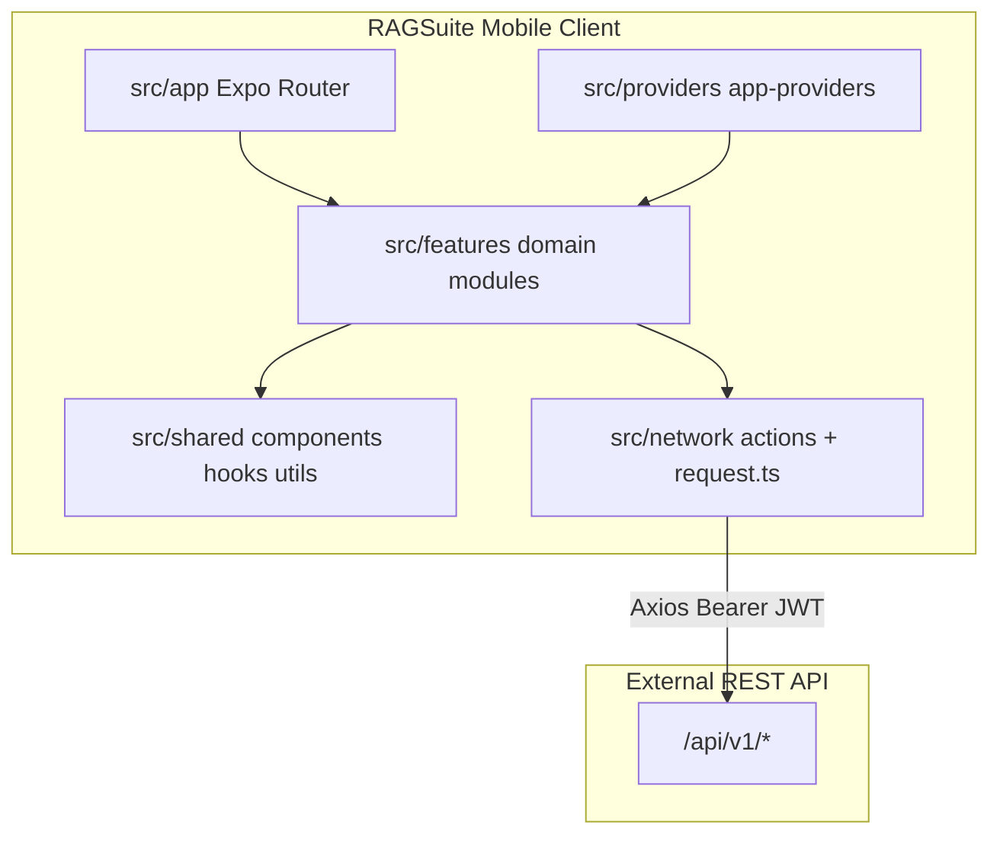

# AI Project Context Report

> Generated by an AI agent during onboarding (see PROJECT_ONBOARDING_PROMPT.md). Facts are cited; assumptions are labeled.

**Generated:** 2026-07-06
**Agent / Tool:** Cursor agent (Claude)
**Repository:** /Users/guru/Documents/Gitlab/RAGSuite_Server/frontend
**Analysis scope:** `536ccfbd9a51e8f2999733cb2054c4489bb22df4` (branch `main`)

---

## Project Overview

### What This Project Is

RAGSuite Mobile is a cross-platform client (iOS, Android, web) for the **RAGSuite** sovereign enterprise AI platform. It is an Expo / React Native application that provides administrators and operators with a branded dashboard to manage projects, crawl sources and documents, configure chatbot and search experiences, review analytics and audit logs, moderate feedback, and interact with an embedded app chat widget — all backed by a REST API.

Evidence: `package.json` (name `ragsuite`, Expo ~55, react-native); `AGENTS.md` (product identity); `src/config/navigation.ts` (route catalog); `src/network/apiUrl.ts` (REST endpoint map).

### Key Facts

- **Cross-platform Expo app** targeting iOS, Android, and web — Evidence: `package.json` scripts `start`, `web`, `android`, `ios`; `react-native-web` dependency
- **TypeScript strict mode** with `@/*` path alias to `src/` — Evidence: `tsconfig.json` (`strict: true`, paths `@/*`)
- **Yarn** package manager — Evidence: `yarn.lock` present; no `package-lock.json`
- **JWT bearer auth** with session persisted in SecureStore (native) or localStorage (web) — Evidence: `src/network/request.ts` (lines 26–37), `src/network/auth-session.ts`, `src/services/storage/storage.ts`
- **Feature-module architecture** under `src/features/` with Expo Router file routes in `src/app/` — Evidence: 18 feature folders; 72 route files under `src/app/`
- **Locked brand design system** (warm paper canvas, pine-green accent) — Evidence: `AGENTS.md`, `tokens/design-tokens.json`, `src/theme/brand-tokens.ts`
- **API base URL** from `env.json` (copied from `envs/*.json`) — Evidence: `src/network/apiUrl.ts` line 1 (`import { API_URL } from "../../env.json"`)

### Assumptions

- **Assumption:** The backend is a separate RAGSuite API service (not in this repo). Rationale: client-only codebase; all data via `/api/v1/*` endpoints in `src/network/apiUrl.ts`; no server entry point found.
- **Assumption:** Web is a first-class deployment target alongside native. Rationale: permanent drawer on web (`src/app/(app)/_layout.tsx` lines 68–71), `Platform.OS === 'web'` branches throughout UI, `setup-skia-web` postinstall.
- **Assumption:** Primary users are enterprise admins / operators managing AI retrieval and chatbot configuration. Rationale: feature set (crawl, API keys, audit logs, embedding reindex, 2FA) — no end-user consumer app patterns.

---

## Architecture Summary

### System Diagram



### Module Map

| Module | Path | Responsibility | Evidence |
| ------ | ---- | -------------- | -------- |
| App shell & routing | `src/app/` | File-based routes, auth gate, drawer layout | `src/app/_layout.tsx`, `src/app/(app)/_layout.tsx` |
| Auth | `src/features/auth/` | Sign-in, 2FA, email verify, session provider | `src/network/apiUrl.ts` AUTH_* paths; `session-provider` |
| Onboarding | `src/features/onboarding/` | First-run workspace setup flow | `src/app/(app)/onboarding.tsx`; commit `cf831b2` |
| Projects | `src/features/projects/` | Multi-project CRUD, active project context | `API_CONFIG.PROJECTS`; `active-project-provider` |
| Crawl | `src/features/crawl/` | Domain sources, jobs, document upload/index | `crawl.actions.ts`, `document.actions.ts`, `CrawlManagementScreen` |
| Configuration | `src/features/configuration/` | API keys, N8n integration, retrieve test | `configuration.actions.ts` |
| Chatbot config | `src/features/chatbot-config/` | Widget settings, training, integrations | `chatbot-config.actions.ts`; routes under `chatbot-config/` |
| Search config | `src/features/search-config/` | Search box, training, history, model settings | `search-config.actions.ts`; routes under `search-config/` |
| App chat widget | `src/features/app-chat-widget/` | In-app floating chat with streaming | `app-chat-widget.actions.ts`; `CHAT_MESSAGE_STREAM` |
| Chat history | `src/features/chat-history/` | Session/message history views | `chat-history.actions.ts` |
| Analytics | `src/features/analytics/` | Dashboard charts, KPIs, export | `analytics.actions.ts`; Skia/Victory charts |
| Compare models | `src/features/compare-models/` | Side-by-side model comparison | `compare-models.actions.ts` |
| Feedback moderation | `src/features/feedback-moderation/` | Review user feedback votes | `feedback-moderation.actions.ts` |
| Audit logs | `src/features/audit-logs/` | Compliance event log browser | `audit-log.actions.ts` |
| Notifications | `src/features/notifications/` | In-app notification panel | `notifications.actions.ts` |
| System health | `src/features/system-health/` | Service health monitoring | `system-health.actions.ts` |
| Settings | `src/features/settings/` | Branding, retention, i18n, theme | `settings.actions.ts` |
| Profile | `src/features/profile/` | User profile management | `profile.actions.ts` |
| Home | `src/features/home/` | Overview / landing dashboard | `src/app/(app)/(tabs)/index.tsx` |
| Network layer | `src/network/` | Axios client, auth interceptors, action modules | `src/network/request.ts` |
| i18n | `src/i18n/` | Translations, locale sync | `src/i18n/locales/en.ts`; `yarn sync-i18n` |
| Theme / brand | `src/theme/`, `tokens/` | Design tokens, navigation theme | `brand-tokens.ts`, `AGENTS.md` |
| Shared UI | `src/shared/` | Reusable fields, navigation chrome, dashboard primitives | `app-select-field.tsx`, `app-drawer.tsx` |

### Data Flow

1. **Bootstrap:** `AppProviders` loads fonts, hydrates auth token from storage, wraps children in session/settings/i18n/project providers (`src/providers/app-providers.tsx`).
2. **Auth gate:** Unauthenticated users redirect to `/(auth)/sign-in`; authenticated users without completed onboarding redirect to `/(app)/onboarding` (`src/app/(app)/_layout.tsx` lines 17–30).
3. **Screen render:** Expo Router resolves `src/app/**` route → feature screen/component → feature hook (e.g. `useCrawlManagement`) → service or network action.
4. **API call:** Action module calls `request()` / `get()` / `post()` from `src/network/request.ts` with Bearer token; response mapped via feature-specific mappers (e.g. `crawl-api-mappers.ts`).
5. **State update:** Hook updates React state; providers sync cross-cutting context (active project, chatbot bundle, settings).
6. **UI feedback:** Shared `StatePanel`, skeletons, toasts, and i18n strings render loading/empty/error states per `.cursor/rules/premium-saas.mdc`.

---

## Technology Stack

| Category | Technology | Version (if known) | Evidence |
| -------- | ---------- | ------------------ | -------- |
| Language | TypeScript | ~5.9.2 | `package.json` devDependencies |
| UI framework | React | 19.2.0 | `package.json` |
| Mobile / web runtime | React Native + react-native-web | 0.83.6 / ~0.21.0 | `package.json` |
| App framework | Expo SDK | ~55.0.17 | `package.json` |
| Routing | Expo Router | ~55.0.13 | `package.json`; `src/app/` |
| Navigation | React Navigation (drawer, tabs) | ^7.x | `package.json`; `src/app/(app)/_layout.tsx` |
| HTTP client | Axios | ^1.17.0 | `src/network/request.ts` |
| Forms | react-hook-form + zod | ^7.73.1 / ^4.3.6 | `package.json` |
| Charts | victory-native, @shopify/react-native-skia | ^41.26.0 / 2.4.18 | `package.json`; analytics components |
| Icons | lucide-react-native | ^1.8.0 | Used across features |
| Secure storage | expo-secure-store (native), localStorage (web) | ^55.0.13 | `src/services/storage/storage.ts` |
| Database | N/A (client-only) | — | No ORM or local DB layer |
| Testing | Jest + jest-expo | ^29.7.0 / ^55.0.16 | `jest.config.js`; 3 test files |
| Linting | ESLint (expo config) | ^9.0.0 | `package.json` script `lint` |
| CI/CD | Not configured in repo | — | No `.github/workflows/` found |
| Package manager | Yarn | 1.x (lockfile) | `yarn.lock` |

---

## Major Features

| Feature | Description | Key files | Status |
| ------- | ----------- | --------- | ------ |
| Authentication | Login, register, 2FA, email verification | `src/features/auth/`, `auth.actions.ts` | Implemented |
| Onboarding | Workspace setup wizard | `src/features/onboarding/` | Implemented |
| Projects | Project list, create/edit, active project | `src/features/projects/` | Implemented |
| Crawl management | Domain sources, jobs, Gmail, documents | `src/features/crawl/`, `crawl.actions.ts` | Active development (recent commits) |
| Configuration | API keys, N8n, retrieve test | `src/features/configuration/` | Implemented |
| Chatbot configuration | Model, widget, training, integrations | `src/features/chatbot-config/` | Implemented |
| Search configuration | Search box, training, history, citations | `src/features/search-config/` | Implemented |
| App chat widget | Floating in-app chat with streaming | `src/features/app-chat-widget/` | Implemented |
| Chat history | Browse/export chat sessions | `src/features/chat-history/` | Implemented |
| Analytics | KPI cards, line/donut charts, export | `src/features/analytics/` | Implemented |
| Compare models | Query multiple models side-by-side | `src/features/compare-models/` | Implemented |
| Feedback moderation | Review and filter user feedback | `src/features/feedback-moderation/` | Implemented |
| Audit logs | Searchable compliance event log | `src/features/audit-logs/` | Implemented |
| Notifications | Notification list and panel | `src/features/notifications/` | Implemented |
| System health | Service status dashboard | `src/features/system-health/` | Implemented |
| Settings | Branding, data retention, language/region | `src/features/settings/` | Implemented |
| Profile | User profile edit | `src/features/profile/` | Implemented |
| Home overview | Dashboard landing | `src/features/home/` | Implemented |

---

## Development History

### Recent Timeline

| Date / Range | Change | Type | Evidence |
| ------------ | ------ | ---- | -------- |
| 2026-07-06 | Dependency updates and component refactors | Refactor | `536ccfb` |
| 2026-07-03 | RAGSuite brand system + Android config | Feature / brand | `8fc5725` |
| 2026-06-24 | Crawl components and functionality | Feature | `053d9b3` |
| 2026-06-18–19 | i18n / translation management overhaul | Feature | `7bd35a4`, `8f4546a` |
| 2026-06-18 | Chat widget, compare models, profile UX | Feature | `638d544`, `ca954b1`, `6ca6e6b` |
| 2026-06-17 | API keys, crawl enhancements, chatbot widget | Feature | `0985446`, `8172e4a`, `d6c156a` |
| 2026-06-16 | Search history, feedback moderation, analytics | Feature | `647638e`, `96aa6ea`, `dec2332` |
| 2026-06-15 | Auth flow, audit logs, projects, onboarding | Feature | `c759166`, `9572ad7`, `6aa3930`, `cf831b2` |
| 2026-06-12 | 2FA, notifications, auth session refactor | Feature / security | `206cb4d`, `5ff8662`, `28735ab` |
| 2026-06-12 | UI/UX guidelines + reference parity workflow | Process | `0134b73` |
| 2026-06-11 | App chat widget feature | Feature | `ee676e4` |
| 2026-06-05 | Compare models feature | Feature | `9c5ce0e` |
| 2026-06-04 | Feedback moderation feature | Feature | `85ba48d` |

### Patterns Observed

- Commit messages use `[TASK]` prefix with descriptive feature-area summaries.
- Development is feature-module oriented: each major capability gets `src/features/<name>/` plus matching `src/network/actions/<name>.actions.ts`.
- Recent sprint focus: brand system compliance, internationalization, crawl/documents UX, and web layout parity.
- Single long-lived branch (`main`); no feature branches visible in local clone.
- UI work increasingly governed by `.cursor/rules/reference-ui-parity.mdc` and screenshot-clone skill (commit `0134b73`).

---

## Current Work In Progress

| Item | Location | Signal | Priority |
| ---- | -------- | ------ | -------- |
| Brand system rollout | `AGENTS.md`, `tokens/`, theme files | Recent commit `8fc5725`; agents must not hardcode colors | High |
| Crawl web UI / toolbar parity | `src/features/crawl/components/` | Recent crawl commits; cursor rules reference crawl patterns | High |
| Dependency / component refactors | Various shared components | Latest commit `536ccfb` | Medium |
| i18n locale expansion | `src/i18n/locales/` | `sync-i18n` script; commits `7bd35a4`, `8f4546a` | Medium |
| AI onboarding artifacts | Repo root | `PROJECT_ONBOARDING_PROMPT.md`, `templates/` added | In progress (this report) |

Note: No `TODO`/`FIXME`/`HACK` comments found in `src/` at analysis time.

---

## Engineering Conventions

### Naming

- **Feature folders:** lowercase kebab-case (`chatbot-config`, `audit-logs`, `feedback-moderation`) — Evidence: `src/features/` listing
- **Components:** PascalCase files (`CrawlDocumentPanel.tsx`, `AppSelectField.tsx`)
- **Hooks:** camelCase with `use` prefix (`useCrawlManagement.ts`, `useAppTheme.ts`)
- **Network actions:** `<domain>.actions.ts` in `src/network/actions/`
- **Types:** `<domain>.types.ts` or `<domain>.api.types.ts` inside feature folders
- **Routes:** Expo Router file names map to URL segments (`src/app/(app)/audit-logs/index.tsx`)

### Code Patterns

- **Feature module layout:** `components/`, `hooks/`, `services/`, `utils/`, `types/`, `screens/` per domain — Evidence: `src/features/crawl/` structure
- **Path alias:** `@/` imports only (no relative `../../../`) — Evidence: `tsconfig.json` paths; consistent usage in `src/app/(app)/_layout.tsx`
- **Shared form controls:** `AppTextField`, `AppSelectField`, `AppButton`, `AppColorField` in `src/shared/components/`
- **Panel cards:** `ConfigurationPanelCard`, `CrawlPanelCard` for section chrome — Evidence: configuration and crawl modules
- **Layout hooks:** `useCrawlLayout`, `useChatbotConfigLayout`, `COMPACT_LAYOUT_BREAKPOINT` (900px) — Evidence: `src/shared/constants/layout.ts`, feature layout utils
- **API mappers:** Raw API DTOs mapped in `*-api-mappers.ts` / `*-mapper.ts` before hitting UI state
- **Providers for domain bundles:** `ChatbotConfigProvider`, `SearchConfigProvider`, `ConfigurationProvider` wired in `app-providers.tsx`

### Testing

- **Framework:** Jest with `jest-expo` preset — Evidence: `jest.config.js`
- **Location:** Co-located `*.test.ts` files (only 3 exist today)
- **Existing tests:** `copy-text.test.ts`, `analytics-chart-utils.test.ts`, `settings.service.test.ts`
- **Coverage policy:** Not documented; effectively minimal
- **Run:** `yarn test`

### Error Handling and Logging

- **API errors:** Centralized in `src/utils/api-error.ts`; Axios interceptor clears session on 401 (`src/network/request.ts` lines 42–50)
- **UI errors:** `StatePanel`, empty states, skeleton loaders per premium-saas rules
- **Auth events:** `notifyUnauthorized()` via `src/network/auth-events.ts` on token expiry
- **No structured logging framework** observed in client code

---

## Technical Debt

| Item | Location | Impact | Suggested action |
| ---- | -------- | ------ | ---------------- |
| Minimal test coverage | 3 test files total | Regressions undetected | Add tests for auth, network mappers, critical hooks |
| 31 TypeScript errors | Various (`tsc --noEmit`) | Type safety gaps; examples: `PressableStateCallbackType.focused`, `WebkitOverflowScrolling` in StyleSheet | Triage and fix incrementally |
| `react-native-element-dropdown` still in deps | `package.json` line 60 | Duplicate select implementations; migration to `AppSelectField` incomplete | Remove after full migration |
| Generic README | `README.md` | Resolved — RAGSuite-specific README added 2026-07-06 |
| No CI/CD workflows | `.github/` absent | No automated lint/test on PR | Add GitHub/GitLab CI pipeline |
| No `PROJECT_CONTEXT.md` at root | Repo root | Human context scattered across AGENTS.md and cursor rules | Adopt `templates/PROJECT_CONTEXT.md` |
| `env.json` gitignored pattern | `envs/*.json` → `env.json` | New devs may miss `yarn env:local` step | Document in README / PROJECT_CONTEXT |

---

## Known Risks

### High-Risk Change Zones

| Zone | Why risky | Required verification |
| ---- | --------- | ---------------------- |
| Auth & session | JWT storage, 2FA, bootstrapping race conditions | Test sign-in/out, 401 handling, token refresh on web + native |
| API keys & configuration | Secret reveal, key rotation | Manual test create/reveal/delete; no secrets in logs |
| Crawl & document upload | File uploads, indexing, bulk actions | Test upload queue, delete, reindex progress |
| Chat widget streaming | SSE/stream parsing, markdown rendering | Test stream interruption, error states, XSS via DOMPurify |
| Embedding reindex | Project-wide destructive operations | Confirm progress polling, cancel, error recovery |
| Audit logs | Compliance data integrity | Verify filters, export, detail view |
| Web Pressable nesting | `Pressable` renders `<button>` on web; nested buttons invalid HTML | Check grid/card components for DOM console errors |
| Cross-platform layout | Web drawer vs native tabs; breakpoint at 900px | QA at 1280, 1024, 900, 720 widths |
| Brand token drift | Hardcoded hex breaks AGENTS.md contract | Visual review against `tokens/design-tokens.json` |

---

## Recommended Development Workflow

### Safe Change Process

1. Read `AI_PROJECT_MEMORY.md`, `AGENTS.md`, and relevant `.cursor/rules/` before editing.
2. For major/cross-cutting work: plan first per `.cursor/rules/system.md` (PLANNER → DEVELOPER → QA → REVIEWER).
3. For screenshot/reference UI: complete Reference Parity Inventory per `reference-ui-parity.mdc`.
4. Reuse existing shared components and layout hooks; extend rather than parallel-implement.
5. Run lint, tests, and `yarn tsc --noEmit` before claiming done.

### Commands

```bash
# Install
yarn install

# Environment (required before API calls work)
yarn env:local    # or env:staging / env:production

# Develop
yarn start        # Expo dev server (all platforms)
yarn web          # Web-only dev server

# Test
yarn test

# Lint
yarn lint

# Typecheck (manual — not in package.json scripts)
yarn tsc --noEmit

# i18n locale sync
yarn sync-i18n
```

### Before Merging

- [ ] `yarn lint` passes
- [ ] `yarn test` passes
- [ ] `yarn tsc --noEmit` — note pre-existing errors; no new errors introduced
- [ ] Web QA at key breakpoints if UI touched (1280, 1024, 900, 720)
- [ ] Loading, empty, and error states verified for changed screens
- [ ] No hardcoded colors outside brand tokens
- [ ] i18n keys added to `en.ts` and synced via `yarn sync-i18n`

---

## Uncertainties

| # | Uncertainty | Missing evidence | Suggested resolution |
| - | ----------- | ---------------- | -------------------- |
| 1 | Backend API contract stability and OpenAPI spec | No OpenAPI/Swagger file in repo; endpoints inferred from `apiUrl.ts` | Obtain API docs from backend team or generate from server |
| 2 | Production deployment pipeline (web + app stores) | No CI/CD, Dockerfile, or EAS config observed | Check external GitLab CI or Expo EAS project settings |
| 3 | Test coverage expectations and QA process | Only 3 unit tests; no e2e (Detox/Playwright) found | Confirm team QA standards and add to PROJECT_CONTEXT.md |

---

## Context Sources Consulted

| Priority | File | Summary |
| -------- | ---- | ------- |
| 1 | `AGENTS.md` | Locked RAGSuite brand system: colors, typography, spacing, component rules |
| 2 | `PROJECT_ONBOARDING_PROMPT.md` | Onboarding workflow and artifact requirements |
| 3 | `templates/AI_PROJECT_CONTEXT_REPORT.md` | Structure guide for this report |
| 4 | `templates/AI_PROJECT_MEMORY.md` | Structure guide for memory file |
| 5 | `.cursor/rules/system.md` | Multi-role engineering lifecycle (plan → implement → QA → review) |
| 6 | `.cursor/rules/reference-ui-parity.mdc` | Screenshot/reference UI matching workflow |
| 7 | `.cursor/rules/premium-saas.mdc` | Premium SaaS UI requirements (empty/loading/error states) |
| 8 | `package.json` | Dependencies, scripts, versions |
| 9 | `src/config/navigation.ts` | App routes, drawer items, header meta |
| 10 | `src/network/apiUrl.ts` | Full REST endpoint catalog |
| 11 | `src/providers/app-providers.tsx` | Provider tree and bootstrap order |
| 12 | `tokens/design-tokens.json` | Machine-readable brand tokens |
| 13 | `envs/local.json` | Local API URL configuration pattern |
| 14 | `README.md` | Generic Expo starter (low signal) |
| 15 | `docs/README.md` | Documentation index and task routing for AI assistants |
| 16 | `git log --oneline -30` | Recent development timeline |
