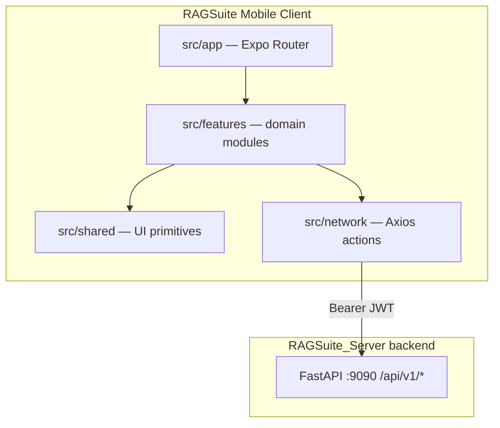

# PROJECT_CONTEXT.md

> **Human-maintained source of truth.** Update when architecture, conventions, or active work changes. AI agents should read this (and `AI_PROJECT_MEMORY.md`) before making changes.

## Overview

| Field | Value |
| ----- | ----- |
| Project name | RAGSuite Mobile (`ragsuite`) |
| Domain | Sovereign enterprise AI platform — admin/operator dashboard client |
| Target users | Enterprise administrators and operators managing RAG pipelines, chatbot/search config, compliance, and projects |
| Repository | https://gitlab.nitsantech.com/nitsan/ai/RAGSuite_Server/frontend |
| Primary contact | NITSAN — [GitLab project](https://gitlab.nitsantech.com/nitsan/ai/RAGSuite_Server/frontend) (Issues/MRs); assign module owners in GitLab |

### Purpose

RAGSuite Mobile is the cross-platform client (iOS, Android, web) for **RAGSuite** — *The Sovereign Enterprise AI Platform*. It is the **target admin UI** succeeding the legacy Vite SPA at `/Users/arun/Desktop/RAGSUITE/frontend`. It provides a branded admin experience to manage crawl sources and documents (including Gmail, Google Drive, Notion), configure chatbot and search widgets, review analytics and audit logs, moderate feedback, compare models, and operate an in-app chat widget — all against the standalone RAGSuite backend (`/Users/arun/RAGSuite_Server/backend`).

The app prioritizes **warm editorial sovereignty** visual design (see `AGENTS.md`) and ships web as a first-class target alongside native.

**Backend pairing:** Prefer backend docs under `RAGSuite_Server/backend/docs/backend/` and the client contract in [docs/BACKEND_API_CONTRACT.md](./docs/BACKEND_API_CONTRACT.md). Compatibility status: [docs/BACKEND_COMPATIBILITY.md](./docs/BACKEND_COMPATIBILITY.md).

## Technology Stack

| Layer | Technology |
| ----- | ---------- |
| Language(s) | TypeScript 5.9 (strict) |
| Framework(s) | Expo SDK ~55, React 19, React Native 0.83, Expo Router ~55 |
| Database | N/A — client-only; persistence via API + local session storage |
| Cache / Queue | N/A in client |
| Auth | JWT Bearer from `POST /api/v1/crawl/auth/login` (body `access_token`); SecureStore / localStorage. Backend also accepts cookies for legacy SPA — dual auth. |
| Hosting | Native: Expo dev builds (`yarn android` / `yarn ios`); Web: `yarn web` / static Expo web export — production hosting TBD outside this repo |
| CI/CD | GitLab at `gitlab.nitsantech.com`; `main` is default branch. No `.gitlab-ci.yml` in repo yet — lint/test run locally before MR |

## Architecture

### High-Level Diagram



### Major Modules

| Module / Directory | Responsibility |
| ------------------ | -------------- |
| `src/app/` | Expo Router file routes; auth gate; drawer + tab shell |
| `src/features/auth/` | Sign-in, register, 2FA, email verification, session (`/crawl/auth/*`) |
| `src/features/onboarding/` | First-run workspace setup (intentionally 2-step) |
| `src/features/projects/` | Multi-project CRUD; active project context |
| `src/features/crawl/` | Domain, documents, Gmail (`/gmail`), Google Drive + Notion (`/connectors/{type}`) |
| `src/features/configuration/` | API keys, N8n integration, retrieve test |
| `src/features/chatbot-config/` | Chatbot model, widget, training, integrations |
| `src/features/search-config/` | Search box, training, history, citations, model settings |
| `src/features/app-chat-widget/` | In-app floating chat (incl. streaming) |
| `src/features/chat-history/` | Chat session/message history |
| `src/features/analytics/` | Dashboard KPIs and charts |
| `src/features/compare-models/` | Side-by-side model comparison |
| `src/features/feedback-moderation/` | User feedback review |
| `src/features/audit-logs/` | Compliance audit event browser |
| `src/features/notifications/` | In-app notifications |
| `src/features/system-health/` | Service health monitoring |
| `src/features/settings/` | Branding, retention, language/region, theme |
| `src/features/profile/` | User profile |
| `src/features/home/` | Overview / landing dashboard |
| `src/network/` | Axios client, auth interceptors, per-domain `*.actions.ts` |
| `src/shared/` | Reusable components (`AppSelectField`, drawer chrome, form fields) |
| `src/i18n/` | Translations; `yarn sync-i18n` for locale sync |
| `src/theme/`, `tokens/` | Brand tokens and navigation theme |
| `src/providers/` | `AppProviders` composition root |

### External Integrations

| Service | Purpose | Config location |
| ------- | ------- | --------------- |
| RAGSuite Server backend REST API | All business data and operations (`/api/v1`) | `env.json` → `API_URL` **origin** (e.g. `http://localhost:9090`); paths in `apiUrl.ts` |
| Gmail (legacy crawl) | Email ingestion via `/api/v1/gmail/*` | `gmail.actions.ts`; redirect `{API}/api/v1/gmail/auth/callback` |
| Google Drive / Notion | Connector framework `/api/v1/connectors/{type}/*` | `google-drive.actions.ts`, `notion.actions.ts`; OAuth utils under `features/crawl/utils/` |
| N8n | Workflow / retrieve integration | `configuration.actions.ts`; Configuration module UI |
| ngrok (dev) | Tunnel API when not on localhost:9090 | `envs/local.json` — keep CORS / OAuth host aligned (gap G4) |

**Not yet in this client (APIs exist on backend):** org admin `/org/*`, Google SSO `/auth/sso/*`, Confluence / SharePoint / Slack connector panels, `GET /crawl/auth/public-config`.

## Data Model

Key entities are owned by the backend API; the client maps DTOs in feature `types/` and `*-mapper.ts` files:

- **Project:** Workspace container; embedding status, reindex, active project selection
- **Crawl source / job:** Domain crawling pipeline state
- **Document:** Uploaded/indexed files with mime, status, coverage
- **Chatbot / search config bundle:** Model settings, widget customization, training configs
- **Chat session / message:** History and export
- **API key:** Create, reveal, revoke
- **Audit event:** Compliance log entries
- **Feedback entry:** Moderation queue items
- **User / session:** Auth profile, 2FA state

Migrations: N/A — no client-side database. Schema changes happen on the backend API only.

## API and Interfaces

- **REST:** Primary interface. All paths under `/api/v1/*` catalogued in `src/network/apiUrl.ts` and explained in [docs/BACKEND_API_CONTRACT.md](./docs/BACKEND_API_CONTRACT.md). Axios in `src/network/request.ts` with Bearer auth and 401 session clear. SSE streams use `fetch` + Bearer.
- **Auth namespace:** Password auth is `/api/v1/crawl/auth/*` (not `/auth/login`). SSO (pending UI) is `/api/v1/auth/sso/*`.
- **CLI:** None in this repo (backend has `python -m app.cli …`).
- **Webhooks:** Inbound N8n template endpoint (`N8N_INBOUND_TEMPLATE`); no outbound webhook client in app.
- **Background jobs:** Server-side (`background_jobs`, `CONNECTOR_SYNC`, `DOCUMENT_INGEST`). Client polls progress (reindex, crawl/connector jobs).

## Development Workflow

### Setup

```bash
yarn install
yarn env:local          # copies envs/local.json → env.json (required for API_URL)
yarn start              # Expo dev server (iOS / Android / web)
# or
yarn web                # web-only dev server
```

Environment files:

| File | Purpose |
| ---- | ------- |
| `envs/local.json` | Local/staging API URL template |
| `envs/staging.json` | Staging API URL |
| `envs/production.json` | Production API URL |
| `env.json` | Runtime config (gitignored; created by `yarn env:*`) |

### Branch Strategy

- **Default branch:** `main`
- **Remote:** `origin` → `https://gitlab.nitsantech.com/nitsan/ai/RAGSuite_Server/frontend.git`
- **Workflow:** feature branch → GitLab Merge Request → review → merge to `main`
- Run `yarn lint`, `yarn test`, and `yarn tsc --noEmit` locally before opening an MR

### Pull Request Requirements

- `yarn lint` passes
- `yarn test` passes
- `yarn tsc --noEmit` — no **new** TypeScript errors (pre-existing errors being triaged)
- UI changes: verify loading, empty, and error states; web breakpoints 1280 / 1024 / 900 / 720 where relevant
- Brand compliance: no hardcoded colors outside `tokens/design-tokens.json` / `AGENTS.md`
- i18n: new strings in `src/i18n/locales/en.ts`; run `yarn sync-i18n`

## Engineering Conventions

### Naming

- Files: kebab-case for routes/utils; PascalCase for React components (`CrawlDocumentPanel.tsx`)
- Components/classes: PascalCase (`AppSelectField`, `CrawlStatusBadge`)
- Hooks: camelCase with `use` prefix (`useCrawlManagement`)
- Feature folders: lowercase kebab-case (`chatbot-config`, `audit-logs`)
- Database tables: N/A (client-only)

### Patterns

- Feature-module layout: `components/`, `hooks/`, `services/`, `utils/`, `types/`, `screens/` per domain under `src/features/`
- Imports via `@/` path alias only (`tsconfig.json`)
- API calls in `src/network/actions/<domain>.actions.ts`; map responses in feature mappers before UI state
- Reuse shared panel/toolbar patterns: `CrawlPanelCard`, `ConfigurationPanelCard`, `CrawlMobileFilterSection`, `TableHeaderLabel`
- Toolbar control height: `TOOLBAR_CONTROL_HEIGHT` (44px) for search + inline selects (`src/shared/constants/layout.ts`)
- Reference UI parity: when screenshots or web references exist, match exactly (`.cursor/rules/reference-ui-parity.mdc`)

### Testing

- Test location: co-located `*.test.ts` (currently minimal — 3 files)
- Required coverage: not formally defined; manual QA required for UI ([docs/TESTING_AND_QA.md](./docs/TESTING_AND_QA.md))
- Run: `yarn test`

## Active Development

### Current Focus

- Align this client with the Server backend (Bearer contract docs; P0 gaps: public-config, SSO, org UI, env/CORS)
- Brand system enforcement across all screens (`AGENTS.md`, design tokens)
- Crawl module web UI parity (toolbar alignment, list columns, document grid; Drive/Notion OAuth)
- Internationalization expansion (`yarn sync-i18n`); **product-language** copy for chatbot widget / search-test feedback (`translate-for-locale.ts`)
- Chatbot ↔ Search configuration parity (icons, model API-key empty+saved UX, connection-test parsing)
- Organization admin UX (members, project assignments / module permissions)
- Shared component refactors (AppSelectField, AppSwitchRow transparent nesting, dependency updates)

### Known Technical Debt

- `react-native-element-dropdown` still in dependencies — migrate fully to `AppSelectField`
- No `.gitlab-ci.yml` in repository — CI pipeline not yet defined in-repo
- ~31 pre-existing TypeScript errors (`yarn tsc --noEmit`) being triaged

## Risks and Sensitive Areas

| Area | Risk | Extra verification |
| ---- | ---- | ------------------ |
| Auth & session | Token leakage, 2FA bypass, bootstrapping races | Sign-in/out, 401 handling on web + native |
| API keys (configuration + model settings) | Secret exposure; false “saved” / false connection success | Never log keys; empty field + `isSavedApiKeyMarker`; unwrap test-connection `data` envelope |
| Crawl & documents & connectors | Data loss on delete; upload/OAuth failures | Upload queue, bulk actions, reindex; OAuth redirect URIs must match `/api/v1/...` |
| Chat widget streaming | Stream parsing errors, XSS in markdown | DOMPurify usage; interrupt/error states |
| Widget / search-test feedback i18n | Form stays in English while replies match product language | Feedback uses `createTranslatorForLanguage(config.language)` |
| Organization ACL / project assign | Wrong permissions; confusing nested UI | Workspace vs project modules; no white-in-beige switch rows |
| Embedding reindex | Destructive project-wide operation | Progress polling, cancel, error recovery |
| Web Pressable nesting | Invalid `<button>` inside `<button>` DOM | Console check on grid/card components |
| Brand token drift | Visual inconsistency, accessibility | Compare against `tokens/design-tokens.json` |

## Important Decisions

| Date | Decision | Rationale |
| ---- | -------- | --------- |
| 2026-07-03 | Adopt locked RAGSuite brand system (`AGENTS.md`, tokens) | Product identity; warm editorial sovereignty |
| 2026-06-12 | Reference UI parity workflow (cursor rules + skills) | Match web dashboard screenshots exactly |
| 2026-06-11 | In-app chat widget as first-class feature | Operator testing without leaving admin app |
| _ongoing_ | Web as first-class target (permanent drawer, 900px breakpoint) | Enterprise admin use on desktop browsers |

## Changelog (manual)

| Date | Change |
| ---- | ------ |
| 2026-07-15 | Captured org permissions UX, chatbot↔search model-settings / icons / API-key pitfalls, and product-language feedback i18n in memory + skills (docs only) |
| 2026-07-08 | Documented standalone backend contract + compatibility gaps (docs only; no root README change) |
| 2026-07-06 | Initial PROJECT_CONTEXT.md adopted from onboarding (seeded from AI_PROJECT_CONTEXT_REPORT.md) |
| 2026-07-06 | Added docs/ index and .cursor context upgrade (architecture rewrite, AI guides, rules/skills/agents) |
| 2026-07-06 | Replaced root README.md with RAGSuite setup; filled GitLab contact/branch/CI notes in PROJECT_CONTEXT |

## Related Documents

| Document | Purpose |
| -------- | ------- |
| [README.md](./README.md) | Developer quick start |
| [docs/README.md](./docs/README.md) | Documentation index and task routing |
| [docs/BACKEND_API_CONTRACT.md](./docs/BACKEND_API_CONTRACT.md) | Backend `/api/v1` map + OAuth URIs |
| [docs/BACKEND_COMPATIBILITY.md](./docs/BACKEND_COMPATIBILITY.md) | Gaps vs Server backend |
| [AI_PROJECT_MEMORY.md](./AI_PROJECT_MEMORY.md) | Compact AI session memory |
| [AI_PROJECT_CONTEXT_REPORT.md](./AI_PROJECT_CONTEXT_REPORT.md) | Detailed evidence-cited analysis |
| [AGENTS.md](./AGENTS.md) | Locked brand / styling contract for agents |
| [PROJECT_ONBOARDING_PROMPT.md](./PROJECT_ONBOARDING_PROMPT.md) | AI onboarding workflow |
| [.cursor/rules/system.md](./.cursor/rules/system.md) | Agent engineering lifecycle |
| [.cursor/skills/ragsuite-backend-contract/SKILL.md](./.cursor/skills/ragsuite-backend-contract/SKILL.md) | Backend orientation skill |
| [.cursor/skills/chatbot-search-config-parity/SKILL.md](./.cursor/skills/chatbot-search-config-parity/SKILL.md) | Search↔Chatbot config, API keys, product-language feedback |
