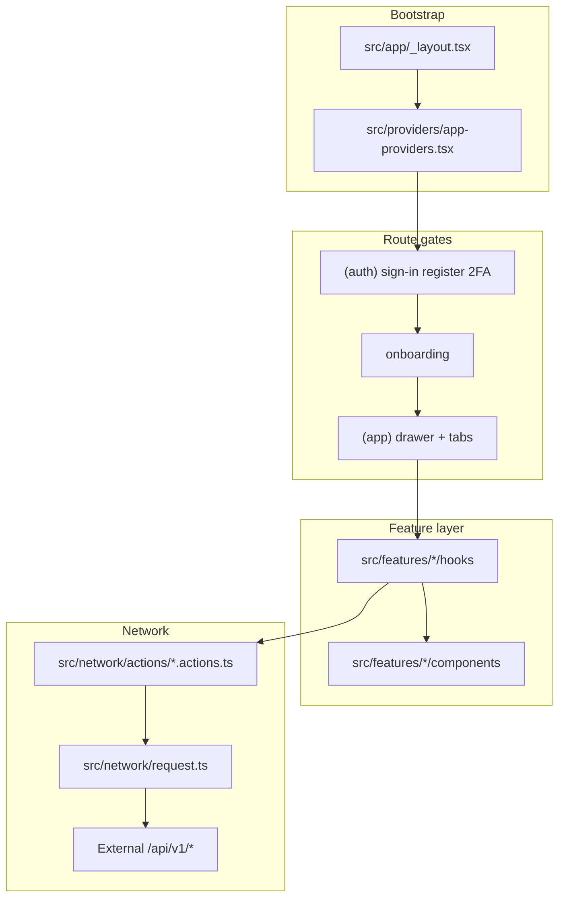
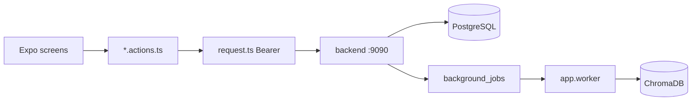

# Architecture

> Evidence-based description of **this repository**. Do not assume Redux, `App.tsx` under `src/app/`, or a `store/` folder — they are not part of this codebase.

## Stack

| Layer | Technology |
| ----- | ---------- |
| Runtime | Expo SDK ~55, React 19, React Native 0.83 |
| Routing | Expo Router (file-based) |
| Language | TypeScript (strict) |
| HTTP | Axios + JWT Bearer (`src/network/request.ts`) |
| Navigation UI | React Navigation drawer + bottom tabs |
| State | React context providers + feature hooks (no Redux) |
| i18n | Custom `I18nProvider` + locale files |
| Theme | `brand-tokens.ts`, `useAppTheme`, `AGENTS.md` |

## High-level diagram



## Actual folder structure

```text
src/
├── app/                    # Expo Router — routes only (no App.tsx here)
│   ├── _layout.tsx         # Root: AppProviders + Slot
│   ├── (auth)/             # Sign-in, register, verify-email, verify-2fa
│   └── (app)/              # Authenticated app
│       ├── _layout.tsx     # Auth gate, drawer, AppChatWidgetHost
│       ├── (tabs)/         # Mobile bottom tabs (hidden on web drawer UX)
│       ├── settings/       # Nested settings routes
│       ├── chatbot-config/ # Nested chatbot routes
│       ├── search-config/  # Nested search routes
│       ├── audit-logs/
│       ├── feedback-moderation/
│       ├── compare-models/
│       └── history/
├── features/               # 18 domain modules (see MODULE_GUIDE.md)
├── shared/                 # Reusable UI, hooks, constants, navigation chrome
├── network/
│   ├── request.ts          # Axios client + interceptors
│   ├── apiUrl.ts           # API_CONFIG endpoint map
│   ├── auth-session.ts     # Token cache + hydrate
│   └── actions/            # Per-domain API functions
├── providers/
│   └── app-providers.tsx   # Font load, session, settings, i18n, domain providers
├── config/
│   └── navigation.ts       # Routes, drawer sections, header meta
├── i18n/
├── theme/
├── services/storage/       # SecureStore (native) / localStorage (web)
└── types/
```

## Bootstrap and providers

`src/app/_layout.tsx` wraps the tree in `AppProviders`.

`src/providers/app-providers.tsx` order:

1. GestureHandler, SafeArea, I18n
2. SessionProvider (auth)
3. SettingsProvider + I18nSettingsSync
4. Brand font load gate
5. ActiveProjectProvider, ChatbotConfigProvider, SearchConfigProvider, ConfigurationProvider, AppChatWidgetProvider
6. Navigation theme, DrawerChromeProvider

## Auth and onboarding gates

`src/app/(app)/_layout.tsx`:

1. `isBooting` → `SplashScreen`
2. `!isAuthenticated` → redirect `/(auth)/sign-in`
3. `needsOnboarding` → redirect `/(app)/onboarding` (URL stays on onboarding)
4. Else → `AppShellProvider` + permanent/front drawer + `Slot`

Session token: `src/network/auth-session.ts` + `src/services/storage/storage.ts`.

## Routing model

- **File = route:** `src/app/(app)/projects.tsx` → `/projects`
- **Route registry:** `src/config/navigation.ts` — `AppRouteName`, drawer sections, header title keys
- **Web:** Drawer is `permanent`; sidebar collapse via `AppShellProvider`
- **Native:** Drawer `front`; bottom tabs for primary modules (`APP_BOTTOM_TAB_ROUTES`)
- **Compact breakpoint:** `COMPACT_LAYOUT_BREAKPOINT = 900` in `src/shared/constants/layout.ts`

## Network layer

1. `env.json` provides `API_URL` as the **API origin** (e.g. `http://localhost:9090` or ngrok host) — from `envs/local.json` etc.
2. `API_CONFIG` in `src/network/apiUrl.ts` lists **full** `/api/v1/*` paths (do not put `/api/v1` inside `API_URL` unless you re-verify joining).
3. Feature `*.actions.ts` files call `get`/`post`/`put`/`delete` from `request.ts`
4. Request interceptor attaches `Authorization: Bearer <token>` (password login under `/api/v1/crawl/auth/*`)
5. Response interceptor clears session on 401 (when token was sent)
6. DTOs mapped in feature `*-mapper.ts` / `*-api-mappers.ts` before UI state (API is snake_case)
7. SSE streaming (`/chat/message/stream`, `/search/stream`, …) uses `fetch` + Bearer, not axios cookies

### Backend the client targets

**Server backend** (`/Users/arun/RAGSuite_Server/backend`): FastAPI API + workers, PostgreSQL, ChromaDB, Redis, job queue. Dev port **9090**. Dual session: Bearer **or** cookie — this client uses Bearer.

High-signal path families (full map: [BACKEND_API_CONTRACT.md](./BACKEND_API_CONTRACT.md)):

| Family | Prefix |
| ------ | ------ |
| Password auth | `/api/v1/crawl/auth/*` |
| SSO (UI pending) | `/api/v1/auth/sso/*` |
| Org (UI pending) | `/api/v1/org/*` |
| Projects / embeddings | `/api/v1/projects/*` |
| Crawl sites | `/api/v1/crawl/*` |
| Documents | `/api/v1/documents/*` |
| Gmail (legacy) | `/api/v1/gmail/*` |
| Connectors | `/api/v1/connectors/{type}/*` (`google_drive`, `notion`, …) |
| Chat / search / chatbot | `/api/v1/chat/*`, `/search/*`, `/chatbot/*` |
| Ops | `/api/v1/overview`, `/analytics/*`, `/audit-events`, … |

OAuth redirects are registered on the **API host** (e.g. `{API_ORIGIN}/api/v1/connectors/notion/auth/callback`). Compatibility gaps: [BACKEND_COMPATIBILITY.md](./BACKEND_COMPATIBILITY.md).



## Web vs native

| Concern | Web | Native |
| ------- | --- | ------ |
| Drawer | Permanent, collapsible | Overlay drawer |
| Primary nav | Drawer only | Bottom tabs + trimmed drawer |
| Session storage | localStorage (`ragsuite.*` prefix) | expo-secure-store |
| Pressable | Renders `<button>` — no nested buttons | No DOM nesting issue |
| Charts | Skia web setup (`setup-skia-web` postinstall) | Skia native |

## Data flow (typical screen)

1. Expo Router mounts route file → feature screen
2. Screen uses feature hook (e.g. `useCrawlManagement`)
3. Hook loads via service or direct `*.actions.ts` call
4. Mapper transforms API response → typed state
5. Components render with `useAppTheme` + `useTranslation`
6. Loading/empty/error via `StatePanel`, skeletons, shared patterns

## What does NOT exist

- No Redux / Zustand global store
- No `src/app/App.tsx`
- No `src/store/` or `*.slice.ts` files
- No client-side SQL/ORM database
- No `.github/workflows` CI in this repo (as of last audit)

## Related docs

- [BACKEND_API_CONTRACT.md](./BACKEND_API_CONTRACT.md) — backend `/api/v1` map for agents
- [BACKEND_COMPATIBILITY.md](./BACKEND_COMPATIBILITY.md) — gaps vs shipped backend
- [MODULE_GUIDE.md](./MODULE_GUIDE.md) — per-feature entry points
- [PRODUCT.md](./PRODUCT.md) — navigation and screens
- [CODE_CONVENTIONS.md](./CODE_CONVENTIONS.md) — patterns and shared components
