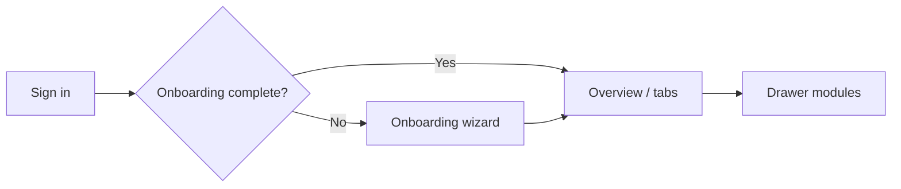

# Product — Modules, Navigation, and Flows

> Derived from `src/config/navigation.ts` and `src/app/**`. Update when routes or drawer items change.

## Product summary

RAGSuite Mobile is an **enterprise admin client** for managing AI retrieval (crawl, documents, Gmail, Google Drive, Notion), chatbot and search configuration, analytics, compliance (audit logs), feedback moderation, and in-app chat testing against the **Server backend** (`/api/v1`).

**Global shell** (all authenticated routes):

| Element | Location |
| ------- | -------- |
| Chrome header | `src/shared/components/navigation/app-chrome-header.tsx` |
| Sidebar drawer | `src/shared/components/navigation/app-drawer.tsx` |
| Notifications panel | `NotificationScreen` in `src/app/(app)/_layout.tsx` |
| Floating chat widget | `AppChatWidgetHost` in `src/app/(app)/_layout.tsx` |
| User profile menu | `src/shared/components/navigation/user-profile-menu.tsx` |

## Drawer navigation

Defined in `drawerNavSections` (`src/config/navigation.ts`):

### Application

| Route | Label key | Module |
| ----- | --------- | ------ |
| `index` | `nav.analytics` | Home / analytics overview |
| `projects` | `projects.title` | Projects |
| `crawl-management` | `nav.crawl` | Crawl (domain, documents, Gmail, Google Drive, Notion) |
| `chatbot-config` | `nav.chatbot-configuration` | Chatbot configuration |
| `search-config` | `nav.search-configuration` | Search configuration |
| `compare-models` | `nav.compare-models` | Compare models |
| `history` | `nav.history` | Chat history |
| `configuration` | `nav.configuration` | API keys & integrations |
| `feedback-moderation` | `nav.feedback` | Feedback moderation |

### Management

| Route | Label key | Module |
| ----- | --------- | ------ |
| `organization` | `nav.organization` | Organization (org admins only) |
| `system-health` | `settings.system-health` | System health |
| `audit-logs` | `settings.audit-logs` | Audit logs |

**Note:** `documents` route exists (`src/app/(app)/documents.tsx`) for deep links but is **not** in the drawer list.

## Mobile bottom tabs

`APP_BOTTOM_TAB_ROUTES`: `index`, `crawl-management`, `chatbot-config`, `search-config`, `settings`.

These routes are **hidden from the mobile drawer** (`MOBILE_DRAWER_HIDDEN_ROUTES`) — users reach them via the tab bar. Web shows all drawer items.

## Nested route groups

### Chatbot config (`src/app/(app)/chatbot-config/`)

| Route file | Purpose |
| ---------- | ------- |
| `overview.tsx` | Settings overview |
| `model-settings.tsx` | Model configuration (API key UX / test-connection — keep parity with Search) |
| `allowed-domains.tsx` | Allowed domains |
| `chat-widget-configuration.tsx` | Widget config (includes **chatbot language** — drives in-widget feedback locale) |
| `chat-widget-customization.tsx` | Widget customization |
| `feedback.tsx` | Feedback settings |
| `integrations.tsx` / `integrations-scripts.tsx` | Integrations |
| `web-integration.tsx` / `mobile-integration.tsx` | Embed snippets |
| `training-overview.tsx` / `training-active-config.tsx` | Training |
| `chat-history/index.tsx` / `[sessionId].tsx` | Training chat history |

**Note:** Keep nav icons and model-settings behaviors aligned with Search unless product requires a difference (`.cursor/skills/chatbot-search-config-parity/`).

### Search config (`src/app/(app)/search-config/`)

| Route file | Purpose |
| ---------- | ------- |
| `settings-overview.tsx` | Settings overview |
| `model-settings.tsx` | Models |
| `allowed-domains.tsx` | Domains |
| `citation-formatting.tsx` | Citations |
| `search-box-configuration.tsx` | Search box config |
| `search-box-customization.tsx` | Search box customization |
| `predefined-questions.tsx` | Predefined questions |
| `integrations-scripts.tsx` | Integrations |
| `search-test.tsx` | Search test |
| `training-overview.tsx` / `training-active-config.tsx` | Training |
| `search-history/index.tsx` / `[sessionId].tsx` | Search history |

### Settings (`src/app/(app)/settings/`)

| Route file | Purpose |
| ---------- | ------- |
| `global-setup.tsx` | Branding |
| `data-retentions.tsx` | Data retention |
| `language-region.tsx` | Language & region |
| `help.tsx` | Help |
| `about-us.tsx` | About |
| `licenses.tsx` | Licenses |
| `terms-of-service.tsx` | Terms |

### Other top-level app routes

| Route | File | Purpose |
| ----- | ---- | ------- |
| `analytics` | `analytics.tsx` | Analytics dashboard |
| `configuration` | `configuration.tsx` | API keys panel |
| `documents` | `documents.tsx` | Documents (deep link) |
| `projects` | `projects.tsx` | Project management |
| `profile` | `profile.tsx` | User profile |
| `notifications` | `notifications.tsx` | Notifications |
| `onboarding` | `onboarding.tsx` | First-run setup |
| `sign-out` | `sign-out.tsx` | Sign out handler |

### Auth (`src/app/(auth)/`)

| Route | Purpose |
| ----- | ------- |
| `sign-in` | Password login; web Google SSO when `public-config.sso_enabled` |
| `login/callback` | SSO return → cookie session hydrate |
| `register` | Public signup (when enabled) or invite activation |
| `verify-email` | Email verification |
| `verify-2fa` | Two-factor authentication |

## Cross-cutting user flows

1. **Auth → onboarding → app:** Session established via `/api/v1/crawl/auth/*` → `useNeedsOnboarding` → **2-step** wizard → home
2. **Project context:** `ActiveProjectProvider` — many API calls scoped with `project_id`
3. **Embedding reindex:** Project-level reindex from projects/crawl/search/chatbot banners
4. **Config bundles:** Chatbot and search config loaded via domain providers on app shell
5. **Connectors:** Crawl tabs Drive/Notion OAuth against `/api/v1/connectors/{type}/*`; Gmail against `/api/v1/gmail/*`. Backend also ships Confluence/SharePoint/Slack (UI pending — [BACKEND_COMPATIBILITY.md](./BACKEND_COMPATIBILITY.md)).

## Module feature folders

| Module | `src/features/` path |
| ------ | -------------------- |
| Analytics | `analytics/` |
| App chat widget | `app-chat-widget/` |
| Audit logs | `audit-logs/` |
| Auth | `auth/` |
| Organization | `organization/` |
| Chat history | `chat-history/` |
| Chatbot config | `chatbot-config/` |
| Compare models | `compare-models/` |
| Configuration | `configuration/` |
| Crawl | `crawl/` |
| Feedback moderation | `feedback-moderation/` |
| Home | `home/` |
| Notifications | `notifications/` |
| Onboarding | `onboarding/` |
| Profile | `profile/` |
| Projects | `projects/` |
| Search config | `search-config/` |
| Settings | `settings/` |
| System health | `system-health/` |

## UI rules (product-level)

- Header shows route title + subtitle from `navigation.ts` header meta helpers
- Drawer footer: edition badges + version (`app-drawer.tsx`)
- AI chat bubble available globally when authenticated (not on onboarding)
- Admin chrome copy via `useTranslation()` / i18n — no hardcoded user-facing strings in new code
- **Embedded product surfaces** (chatbot widget feedback, search-test feedback) follow **product language** settings (`createTranslatorForLanguage`), not the admin dashboard locale
- Organization: Management drawer panels (overview / members / SSO); “All Projects” → `/projects`

## Related docs

- [MODULE_GUIDE.md](./MODULE_GUIDE.md) — implementation file map per module
- [ARCHITECTURE.md](./ARCHITECTURE.md) — technical structure
- [BACKEND_API_CONTRACT.md](./BACKEND_API_CONTRACT.md) — backend `/api/v1` contract
- [BACKEND_COMPATIBILITY.md](./BACKEND_COMPATIBILITY.md) — gaps vs Server backend
- [AGENTS.md](../AGENTS.md) — visual brand contract
